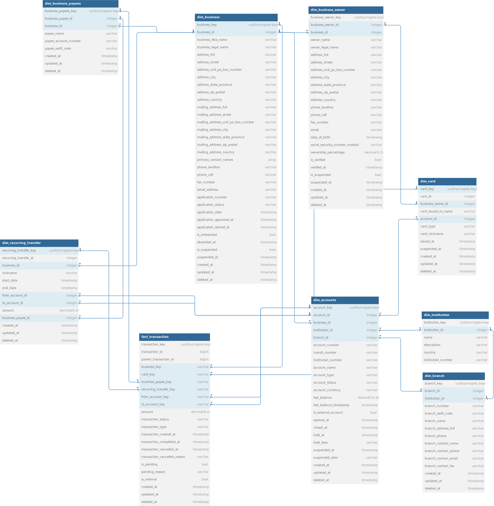

# Data Warehouse Design for Banking Sector

This project outlines a theoretical Data Warehouse design for a Business Banking-focused bank. The design follows modern data warehousing principles and leverages cloud-based columnar databases for scalability and performance.

Key Objectives:
- Efficiently store and manage data for business banking activities.
- Support complex analytical queries for business insights.
- Provide a foundation for reporting and data visualization.
- Facilitate data integration from various sources within the banking ecosystem.

Flexibility:
- Easily adaptable for other banking sectors with minor modifications.
- Allows for iterative refinement based on real data and user feedback.

Overall, the Data Warehouse aims to empower the bank with data-driven insights for strategic decision-making, enhanced customer experiences, and competitive advantage.

## Caveats

1. **Cloud-Based Columnar Database:** The data warehouse will be hosted on a cloud-based columnar database, like Snowflake.

2. **Design Principles:** The data warehouse design adheres loosely to the Kimball/Inmon style, incorporating concepts commonly found in modern businesses with small-medium data teams and a decent level of maturity. To optimize query performance and reduce the need for joins on fact tables, data might be duplicated when appropriate.

3. **Incomplete Data Model:** This data model serves as an initial draft and starting point for design. It is advisable to generate mock queries and potentially mock data for testing purposes to answer business questions. This iterative process allows for validating assumptions and refining the design, which is particularly useful for startups, enabling a rapid build-break-build cycle.

4. **Unknown Input Data:** The schema or design of the banking application's input data is unknown, leading to a healthy dose of assumptions during the design process. Without input from business Subject Matter Experts (SMEs), the design is based on typical banking functions and activities.

5. **Surrogate Keys Usage:** The data model heavily employs surrogate keys (UUIDs) to generate unique identifiers based on distinct field combinations. This approach aids data testing and self-documents the data granularity in the DDL.

6. **Alternative Approach:** While an alternative "One Big Table" design exists, it has not been widely adopted as compared to the current design.

## Problem Statement

You are working with a bank that focuses on banking for small-medium businesses. Design a data model for a data warehouse that answers the discussion questions listed below using the information provided in the background.

**Background:**
The bank is a digital business bank that simplifies the process of opening business bank accounts for small-medium enterprises. Once applications are approved, businesses are onboarded, and customers can create multiple checking accounts, issue debit cards to employees, and make payments to payees using various methods like ACH and Wires. Customers can also fund their accounts by linking external bank accounts.

**Discussion Questions:**
To facilitate the required reporting and analysis, consider designing the schema to answer the following sample questions:

1. **Debit Card Transactions:** Determine the total dollar amount of debit card transactions on the platform for a specific week.

2. **Largest Customers:** Identify the largest customers based on payment volume.

3. **Total Balance:** Calculate the total end-of-week balance across all accounts at the bank.

## Design

## Design Code
The `/dbdiagrams` directory contains code specifically tailored for dbdiagrams.io, an online tool for creating database diagrams. To utilize this code, simply copy and paste it into the editor on [dbdiagrams.io](dbdiagrams.io). The tool will automatically process the code and generate a visual representation of the database schema, showcasing tables, relationships, and attributes in an organized diagram.